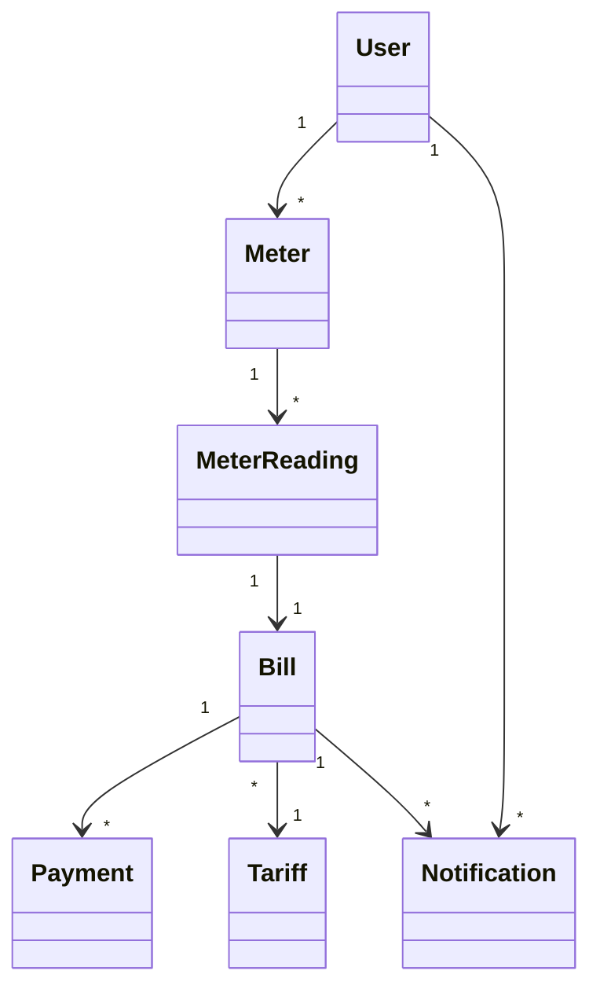

# Utility Billing Management System


A Utility Billing Management System for managing customers, utility meters, meter readings, tariffs, bill generation, payments, notifications, and user authentication. The system supports role-based access control, automated billing workflows, payment tracking, and notification management.

---

## Technology Stack

### Backend

* Java 17
* Spring Boot
* Spring Security
* Spring Data JPA
* JWT Authentication
* Maven

### Database

* PostgreSQL
* Hibernate / JPA

### Communication

* REST APIs
* Email Notifications (SMTP)

### Documentation & Testing

* OpenAPI / Swagger
* REST Test Collections
* Mermaid Diagrams

---

# Project Overview

The system manages the complete utility billing lifecycle:

1. User registration and authentication
2. Customer and meter management
3. Meter reading capture
4. Tariff management
5. Automated bill generation
6. Payment processing
7. Notification management
8. Reporting and administration

The application follows a layered architecture consisting of Controllers, Services, Repositories, and Database entities.

---

## Role-Based Access Control (RBAC)

The system implements Role-Based Access Control using Spring Security and JWT.

### Available Roles

| Role          | Description                                      |
| ------------- | ------------------------------------------------ |
| ROLE_ADMIN    | Full system administration                       |
| ROLE_FINANCE  | Manages billing and approves payments            |
| ROLE_OPERATOR | Meter reading, billing, and payment operations   |
| ROLE_CUSTOMER | View personal bills, payments, and notifications |

### Security Features

* JWT Authentication
* Password Encryption
* Email Verification using OTP
* Role-Based Authorization
* Protected REST Endpoints

---

# Project Structure

```text
src
├── main
│   ├── java
│   │   └── com.chrispin.utility_billing_system
│   │       ├── config
│   │       ├── controller
│   │       ├── dto
│   │       │   ├── request
│   │       │   └── response
│   │       ├── entity
│   │       ├── enums
│   │       ├── exception
│   │       ├── repository
│   │       ├── security
│   │       ├── service
│   │       └── util
│   └── resources
│       └── db
└── test
```

---

# Architecture Overview

See: [Architecture Diagram](docs/system_arch.mmd)

---

# Authentication Flow

See: [Authentication flow diagram](docs/auth_flow.mmd)

---

# Billing Flow

See: [Billing flow diagram](docs/billing_flow.mmd)

---

# Payment Flow

See: [Payment flow diagram](docs/payment_flow.mmd)

---

# Notification Flow

See: [Notification flow](docs/notification_flow.mmd)

---

# Core Domain Relationships



---

# Main Functional Areas

## Authentication

* User Registration
* Login
* JWT Authentication
* Email Verification
* Password Reset
* Password Change

## Customer Management

* Create Customer
* Update Customer
* View Customer Details
* Manage Customer Status

## Meter Management

* Register Utility Meters
* Assign Meters to Customers
* Manage Meter Status

## Meter Reading Management

* Capture Readings
* Calculate Consumption
* Validate Reading Cycles

## Tariff Management

* Create Tariffs
* Activate Tariffs
* Resolve Applicable Tariffs by Billing Cycle

## Billing Management

* Generate Bills
* Calculate Consumption Charges
* Apply Service Charges
* Apply Taxes
* Manage Outstanding Balances

## Payment Management

* Record Payments
* Update Bill Balances
* Track Payment History

## Notification Management

* Bill Notifications
* Payment Notifications
* Notification Tracking

---

# Database Design

Database diagrams and schema documentation are available in the `docs/` directory.

Contents include:

* Entity Relationship Diagram (ERD)
* DBML Schema
* Process Flow Diagrams
* System Architecture Diagrams

---

# Running the Project

## Prerequisites

* Java 17+
* Maven 3.9+
* PostgreSQL 17+

---

## Clone Repository

```bash
git clone https://github.com/Mchiir/java_ne.git
cd java_ne
```

---

## Create Database

```sql
CREATE DATABASE utility_billing_db;
```

---

## Configure Application Properties

Update database connection settings inside:

```text
src/main/resources/application.properties
```

---

## Configure Environment Variables

Create a private `run.md` file based on `run.example.md`.

Example:

Sample for secure JWT secret generation:

```bash
python -c "import secrets, string; print(''.join(secrets.choice(string.ascii_letters + string.digits) for _ in range(128)))"
```

then populate values, copy and run in powershell, or follow

```powershell
$env:JWT_SECRET="YOUR_JWT_SECRET_HERE"; `
$env:MAIL_USERNAME="YOUR_GMAIL_ADDRESS"; `
$env:MAIL_PASSWORD="YOUR_GMAIL_APP_PASSWORD"; `
mvn spring-boot:run
```

for linux users

```bash
JWT_SECRET="YOUR_JWT_SECRET_HERE" \
MAIL_USERNAME="YOUR_GMAIL_ADDRESS" \
MAIL_PASSWORD="YOUR_GMAIL_APP_PASSWORD" \
mvn spring-boot:run
```

---

## Build Project

```bash
mvn clean package
```

---

## Run Project

```bash
mvn spring-boot:run
```

---

# API Documentation

After starting the application, OpenAPI documentation is available through Swagger UI.

```text
http://localhost:8080/swagger-ui/index.html
```

---

# REST Testing (requires **REST Client** vscode extension)

Sample REST requests and testing resources are available in:

```text
rest-tests/
```

---

# Documentation

Project documentation and visual diagrams are available in:

```text
docs/
```

---